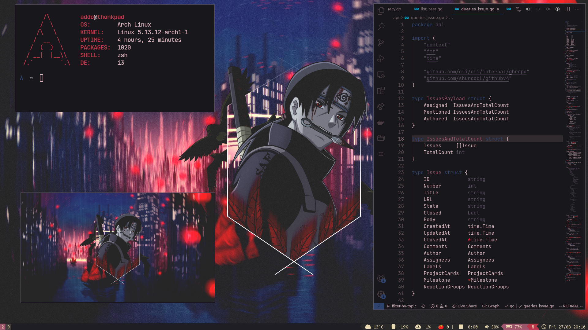

# dotfiles 🐧
  

## Setup
- **Distro**                       : [Arch Linux](https://www.archlinux.org/) :computer: Rolling-release distribution
- **WM**                           : [i3](https://i3wm.org/) Tiling window manager for X11
- **Bar**                          : [i3status-rust](https://github.com/greshake/i3status-rust) :crab: i3status replacement written in Rust!
- **Shell**                        : [zsh](https://wiki.archlinux.org/index.php/zsh) :shell: with [oh my zsh](https://github.com/ohmyzsh/ohmyzsh) framework!
- **Terminal**                     : [Alacritty](https://github.com/alacritty/alacritty) :crab: GPU-accalerated terminal in Rust!
- **Text Editor**                  : [NeoVim](https://neovim.io/) Hyperextensible Vim-based text editor
- **Music Player**                 : [Spicetify](https://github.com/khanhas/spicetify-cli) :notes: Customizable Spotify Client
- **Notify Daemon**                : [Dunst](https://wiki.archlinux.org/index.php/Dunst) :leaves: minimalism!
- **Application Launcher**         : [Dmenu](https://tools.suckless.org/dmenu/) :rocket: dynamic menu by suckless.org
- **File Manager**                 : [Ranger](https://wiki.archlinux.org/index.php/ranger) :bookmark: text-based file manager in python
- **PDF Reader**                   : [Zathura](https://wiki.archlinux.org/index.php/zathura) :green_book: minimal pdf-reader with vi keybindings

## Installation
Do not run the install script, as I haven't tested it and as it will wipe out some of your directories.

## Scripts
- **`books`**: list all books via dmenu and open specified book at the end
- **`corona`**: display corona stats in germany, italy and the netherlands
- **`create`**: create local git repo and push to github
- **`game`**: launcher script for game consoles and corresponding game files
- **`note`**: create .md file note
- **`notes`**: display all notes in fzf and glow
- **`pdfmerge`**: merge different .pdf files into one
- **`remaps`**: caps-esc switch and higher xrate frequency
- **`setbg`**: set background and pywal to either random or specified wallpaper
- **`up`**: go up by n directories
- **`weather`**: display weather in local city 
